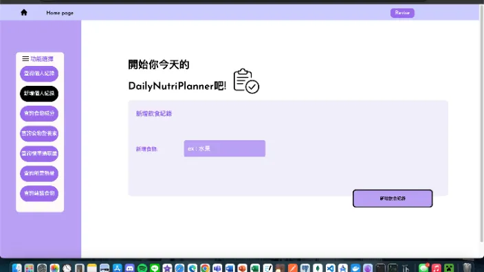

# DailyNutriPlanner - An auto food analysis & recommand web app

## What can it do for you ?
1. Randomly recommand a food based on the nutrition you need
2. Calculate BMI
3. Display all the nutrition you need a day
4. Record food what and when you eat 

## How to use it ?
1. `git clone`
2. Build MySQL database with `schema.sql` in Data
3. Import all needed data into database by running `PreProcess.ipynb`
4. `cd BackEnd && go run main.go`
5. Run `LoginPage.html`
6. Then you can use this app locally